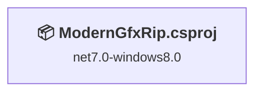
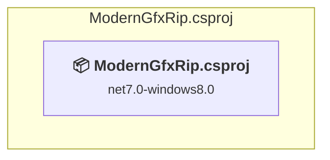

# Projects and dependencies analysis

This document provides a comprehensive overview of the projects and their dependencies in the context of upgrading to .NETCoreApp,Version=v10.0.

## Table of Contents

- [Executive Summary](#executive-Summary)
  - [Highlevel Metrics](#highlevel-metrics)
  - [Projects Compatibility](#projects-compatibility)
  - [Package Compatibility](#package-compatibility)
  - [API Compatibility](#api-compatibility)
  - [Binding Redirect Configuration](#binding-redirect-configuration)
- [Aggregate NuGet packages details](#aggregate-nuget-packages-details)
- [Top API Migration Challenges](#top-api-migration-challenges)
  - [Technologies and Features](#technologies-and-features)
  - [Most Frequent API Issues](#most-frequent-api-issues)
- [Projects Relationship Graph](#projects-relationship-graph)
- [Project Details](#project-details)

  - [ModernGfxRip\ModernGfxRip.csproj](#moderngfxripmoderngfxripcsproj)

## Executive Summary

### Highlevel Metrics

| Metric | Count | Status |
| :--- | :---: | :--- |
| Total Projects | 1 | All require upgrade |
| Total NuGet Packages | 0 | All compatible |
| Total Code Files | 8 |  |
| Total Code Files with Incidents | 11 |  |
| Total Lines of Code | 2990 |  |
| Total Number of Issues | 426 |  |
| Estimated LOC to modify | 425+ | at least 14.2% of codebase |

### Projects Compatibility

| Project | Target Framework | Difficulty | Package Issues | API Issues | Binding Issues | Est. LOC Impact | Description |
| :--- | :---: | :---: | :---: | :---: | :---: | :---: | :--- |
| [ModernGfxRip\ModernGfxRip.csproj](#moderngfxripmoderngfxripcsproj) | net7.0-windows8.0 | 🟡 Medium | 0 | 425 | 0 | 425+ | Wpf, Sdk Style = True |

### Package Compatibility

| Status | Count | Percentage |
| :--- | :---: | :---: |
| ✅ Compatible | 0 | 0.0% |
| ⚠️ Incompatible | 0 | 0.0% |
| 🔄 Upgrade Recommended | 0 | 0.0% |
| ***Total NuGet Packages*** | ***0*** | ***100%*** |

### API Compatibility

| Category | Count | Impact |
| :--- | :---: | :--- |
| 🔴 Binary Incompatible | 416 | High - Require code changes |
| 🟡 Source Incompatible | 0 | Medium - Needs re-compilation and potential conflicting API error fixing |
| 🔵 Behavioral change | 9 | Low - Behavioral changes that may require testing at runtime |
| ✅ Compatible | 901 |  |
| ***Total APIs Analyzed*** | ***1326*** |  |

## Aggregate NuGet packages details

| Package | Current Version | Suggested Version | Projects | Description |
| :--- | :---: | :---: | :--- | :--- |

## Top API Migration Challenges

### Technologies and Features

| Technology | Issues | Percentage | Migration Path |
| :--- | :---: | :---: | :--- |
| WPF (Windows Presentation Foundation) | 320 | 75.3% | WPF APIs for building Windows desktop applications with XAML-based UI that are available in .NET on Windows. WPF provides rich desktop UI capabilities with data binding and styling. Enable Windows Desktop support: Option 1 (Recommended): Target net9.0-windows; Option 2: Add <UseWindowsDesktop>true</UseWindowsDesktop>. |

### Most Frequent API Issues

| API | Count | Percentage | Category |
| :--- | :---: | :---: | :--- |
| T:System.Windows.Media.Color | 44 | 10.4% | Binary Incompatible |
| T:System.Windows.Media.Imaging.WriteableBitmap | 36 | 8.5% | Binary Incompatible |
| T:System.Windows.Media.Imaging.BitmapPalette | 24 | 5.6% | Binary Incompatible |
| T:System.Windows.Controls.TextBox | 16 | 3.8% | Binary Incompatible |
| M:System.Windows.Media.Color.FromRgb(System.Byte,System.Byte,System.Byte) | 15 | 3.5% | Binary Incompatible |
| T:System.Windows.Controls.Image | 13 | 3.1% | Binary Incompatible |
| T:System.Windows.RoutedEventHandler | 12 | 2.8% | Binary Incompatible |
| T:System.Windows.Controls.Label | 12 | 2.8% | Binary Incompatible |
| T:System.Windows.Input.ExecutedRoutedEventHandler | 10 | 2.4% | Binary Incompatible |
| T:System.Windows.Input.CanExecuteRoutedEventHandler | 10 | 2.4% | Binary Incompatible |
| T:System.Windows.Media.PixelFormat | 10 | 2.4% | Binary Incompatible |
| P:System.Windows.Media.Imaging.BitmapSource.PixelWidth | 10 | 2.4% | Binary Incompatible |
| M:System.Windows.Media.Imaging.BitmapPalette.#ctor(System.Collections.Generic.IList{System.Windows.Media.Color}) | 10 | 2.4% | Binary Incompatible |
| P:System.Windows.Media.Imaging.BitmapSource.Format | 8 | 1.9% | Binary Incompatible |
| P:System.Windows.Media.PixelFormat.BitsPerPixel | 8 | 1.9% | Binary Incompatible |
| T:System.Windows.Controls.Button | 6 | 1.4% | Binary Incompatible |
| T:System.Windows.Application | 6 | 1.4% | Binary Incompatible |
| M:System.Windows.Window.#ctor | 6 | 1.4% | Binary Incompatible |
| T:System.Windows.Controls.RadioButton | 6 | 1.4% | Binary Incompatible |
| T:System.Windows.Controls.Canvas | 6 | 1.4% | Binary Incompatible |
| T:System.Windows.Controls.MenuItem | 6 | 1.4% | Binary Incompatible |
| T:System.Uri | 5 | 1.2% | Behavioral Change |
| T:System.Windows.RoutedEventArgs | 5 | 1.2% | Binary Incompatible |
| T:System.Windows.Controls.TextBlock | 5 | 1.2% | Binary Incompatible |
| E:System.Windows.Input.CommandBinding.Executed | 5 | 1.2% | Binary Incompatible |
| E:System.Windows.Input.CommandBinding.CanExecute | 5 | 1.2% | Binary Incompatible |
| T:System.Windows.Input.ExecutedRoutedEventArgs | 5 | 1.2% | Binary Incompatible |
| T:System.Windows.Input.CanExecuteRoutedEventArgs | 5 | 1.2% | Binary Incompatible |
| P:System.Windows.Input.CanExecuteRoutedEventArgs.CanExecute | 5 | 1.2% | Binary Incompatible |
| M:System.Uri.#ctor(System.String,System.UriKind) | 4 | 0.9% | Behavioral Change |
| P:System.Windows.Controls.TextBox.Text | 4 | 0.9% | Binary Incompatible |
| T:System.Windows.MessageBoxResult | 4 | 0.9% | Binary Incompatible |
| P:Microsoft.Win32.FileDialog.FileName | 4 | 0.9% | Binary Incompatible |
| M:System.Windows.Application.LoadComponent(System.Object,System.Uri) | 3 | 0.7% | Binary Incompatible |
| T:System.Windows.Markup.IComponentConnector | 3 | 0.7% | Binary Incompatible |
| T:System.Windows.Window | 3 | 0.7% | Binary Incompatible |
| P:System.Windows.Controls.TextBlock.Text | 3 | 0.7% | Binary Incompatible |
| T:System.Windows.Int32Rect | 3 | 0.7% | Binary Incompatible |
| M:System.Windows.Int32Rect.#ctor(System.Int32,System.Int32,System.Int32,System.Int32) | 3 | 0.7% | Binary Incompatible |
| M:System.Windows.Media.Imaging.WriteableBitmap.WritePixels(System.Windows.Int32Rect,System.Array,System.Int32,System.Int32) | 3 | 0.7% | Binary Incompatible |
| P:System.Windows.Media.Imaging.BitmapSource.PixelHeight | 3 | 0.7% | Binary Incompatible |
| E:System.Windows.Controls.Primitives.ButtonBase.Click | 2 | 0.5% | Binary Incompatible |
| P:System.Windows.Window.DialogResult | 2 | 0.5% | Binary Incompatible |
| P:System.Windows.Window.Title | 2 | 0.5% | Binary Incompatible |
| E:System.Windows.Controls.Primitives.ToggleButton.Checked | 2 | 0.5% | Binary Incompatible |
| E:System.Windows.Controls.MenuItem.Click | 2 | 0.5% | Binary Incompatible |
| T:System.Windows.MessageBoxImage | 2 | 0.5% | Binary Incompatible |
| T:System.Windows.MessageBoxButton | 2 | 0.5% | Binary Incompatible |
| T:System.Windows.MessageBox | 2 | 0.5% | Binary Incompatible |
| M:Microsoft.Win32.CommonDialog.ShowDialog | 2 | 0.5% | Binary Incompatible |

## Projects Relationship Graph

Legend:
📦 SDK-style project
⚙️ Classic project

## Project Details

### ModernGfxRip\ModernGfxRip.csproj

#### Project Info

- **Current Target Framework:** net7.0-windows8.0
- **Proposed Target Framework:** net10.0-windows
- **SDK-style**: True
- **Project Kind:** Wpf
- **Dependencies**: 0
- **Dependants**: 0
- **Number of Files**: 9
- **Number of Files with Incidents**: 11
- **Lines of Code**: 2990
- **Estimated LOC to modify**: 425+ (at least 14.2% of the project)

#### Dependency Graph

Legend:
📦 SDK-style project
⚙️ Classic project

### API Compatibility

| Category | Count | Impact |
| :--- | :---: | :--- |
| 🔴 Binary Incompatible | 416 | High - Require code changes |
| 🟡 Source Incompatible | 0 | Medium - Needs re-compilation and potential conflicting API error fixing |
| 🔵 Behavioral change | 9 | Low - Behavioral changes that may require testing at runtime |
| ✅ Compatible | 901 |  |
| ***Total APIs Analyzed*** | ***1326*** |  |

#### Project Technologies and Features

| Technology | Issues | Percentage | Migration Path |
| :--- | :---: | :---: | :--- |
| WPF (Windows Presentation Foundation) | 320 | 75.3% | WPF APIs for building Windows desktop applications with XAML-based UI that are available in .NET on Windows. WPF provides rich desktop UI capabilities with data binding and styling. Enable Windows Desktop support: Option 1 (Recommended): Target net9.0-windows; Option 2: Add <UseWindowsDesktop>true</UseWindowsDesktop>. |

